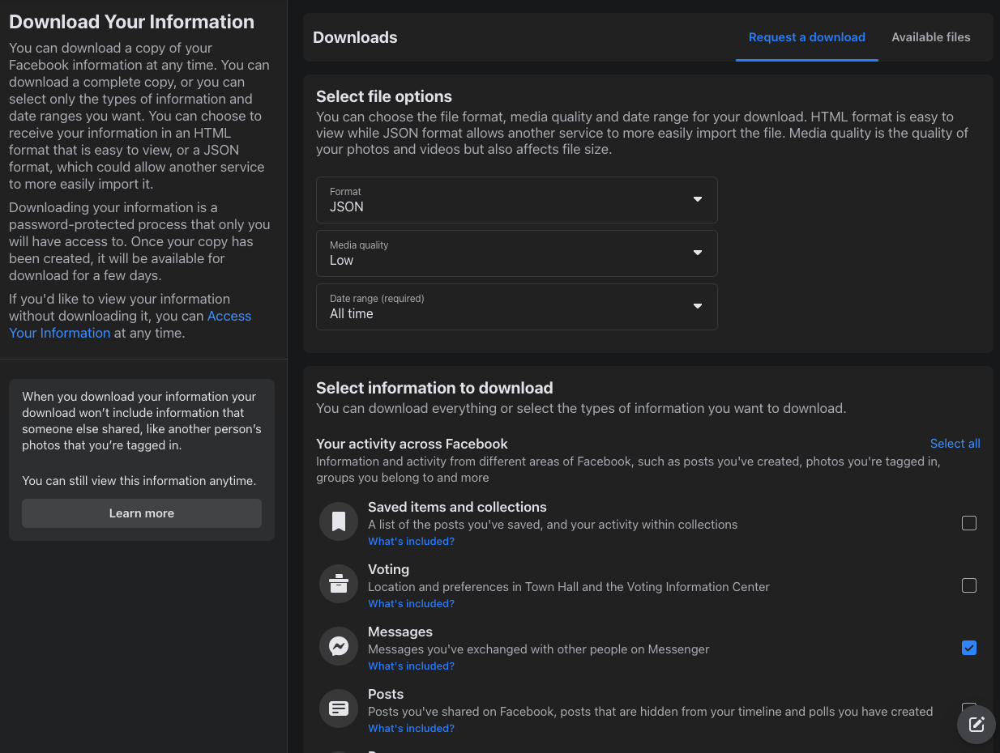
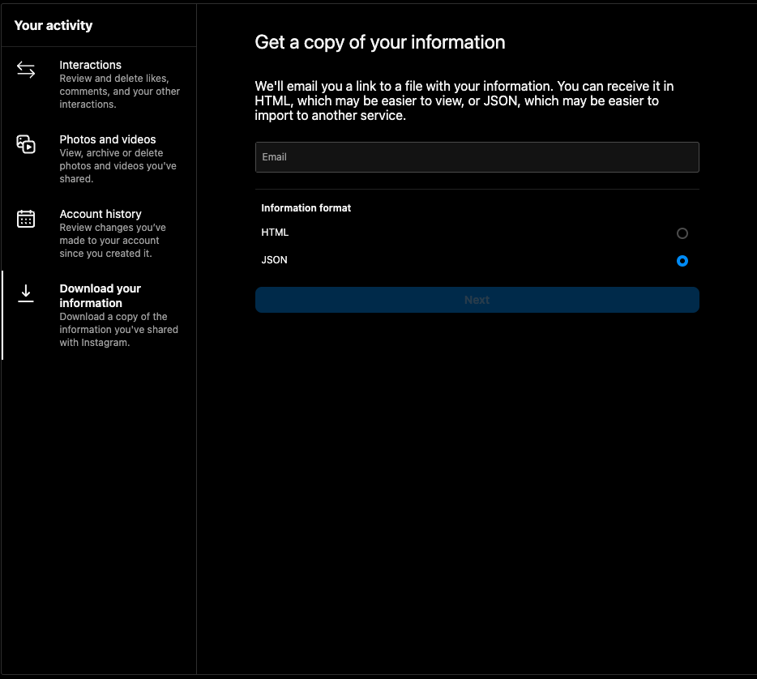
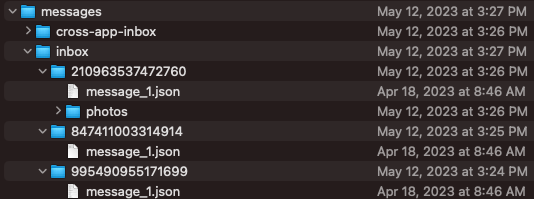

# Meta Embeddings :iphone::rocket:
Create embeddings for Facebook Messenger and Instagram chat history with two steps. 

## Getting Started

### Step 1: Download Messenger / Instagram data
Because of GDPR, users can download data, which includes your chat history on Facebook Messenger and Instagram. For a complete guide on how to request your data from Facebook, check out here for [Messenger](https://www.facebook.com/help/212802592074644/) and here for [Instagram](https://help.instagram.com/181231772500920).






_**Note:** Make sure you don't have professional mode turned on. [Professional mode](https://www.facebook.com/business/help/545581016154662) is a new Facebook feature that allows you to manage your Facebook / Instagram as a business owner. Since there might be sensitive data about customers, you can't download chat data when you're on the professional mode._ 

### Step 2: Put the `messages/` folder in the same directory as `src/` 

Once you have downloaded the data, the directory would look like this. 


Select conversations that you want to create embeddings and drop them in a `messages` folder in the same directory as `src`

### Step 3: Install required packages

Run the following command in your Terminal to install the required Python packages:

```
pip install -r requirements.txt
```

### Step 4: Create embeddings

Execute the following command:

```
python src/embed_chats.py
```
This might take a few minutes depending on how much data you provide. 

---

## Ask questions about your past conversations
Now that you've created the embeddings, you can use OpenAI to ask questions about your chat history. 

### Set up environment variables
Rename `.env.example` to `.env`:
```
cp .env.example .env
```
then, update OPENAI_API_KEY with your OpenAI secret key.

### Ask questions


Execute the following command:

```
python src/query.py
```

Try asking questions such as "When did I last talk to Angela?" or "Generate three trivia questions based on my conversation with Alex"